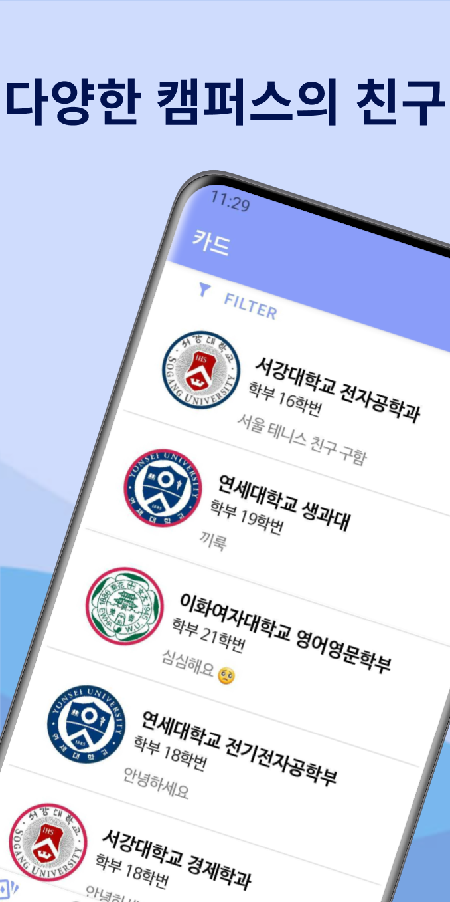
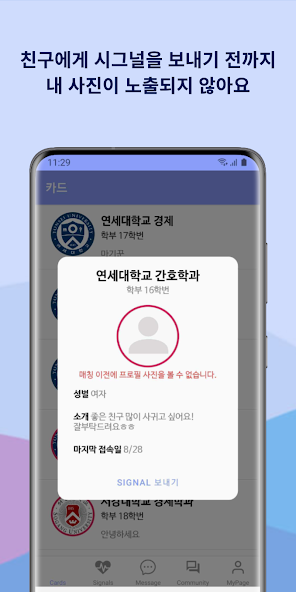
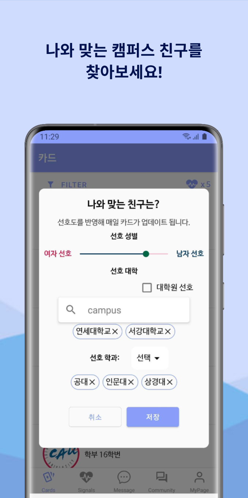
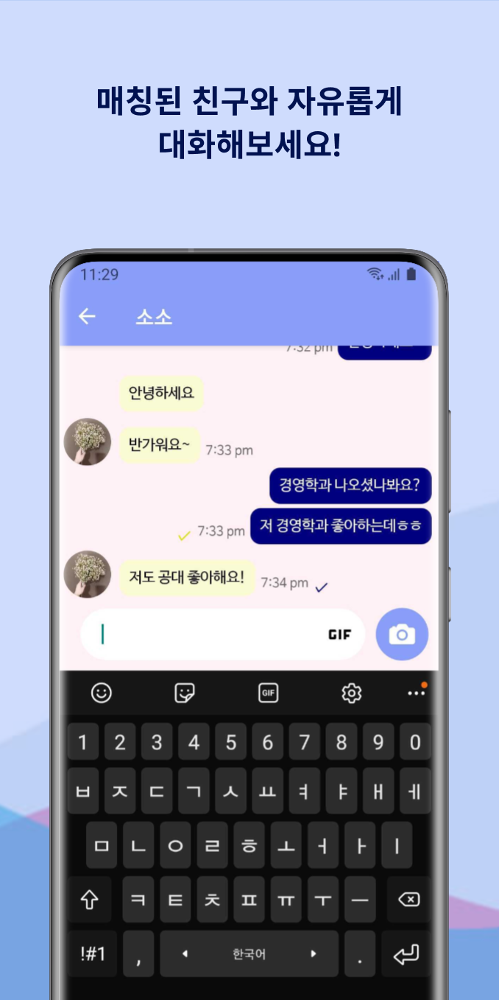

# 캠퍼스밋

*Sep 19th, 2021*

 

React Native 로 제작한 대학생 만남 앱입니다. (현재 운영 X)

## 앱 기능

피드에서 유저들을 확인할 수 있습니다.
 

팝업으로 유저의 세부 정보를 확인 후 시그널을 보낼 수 있습니다.

 
필터를 이용해 원하는 정보의 유저만 불러올 수 있습니다.

 

매칭이 되면 프로필이 공개되고 채팅으로 대화를 나눌 수 있습니다.

 

## 기술 스택
- 프론트
  - React Native + Expo
- db 및 서버
  - aws amplify
    - graphql + dynamodb
    - cognito
    - s3 
  - aws lambda 
    - chalice, python

## 이모 저모
- 기술적 한계
  - 처음 도전해 본 앱이다 보니 많은 부분 미스테이크가 있었는데 다음과 같다.
  - 리액트 네이티브의 문제점
    - 기본 기능만 제공되고 많은 부분을 커뮤니티 라이브러리에 의지해야 하는데 이 부분이 생각보다 버그가 많아서 시간을 많이 소모함. 단순한 카메라나 애니메이션 구현조차 어려움을 겪음
    - Expo를 사용해서 진행을 했는데 Expo를 사용하면 편리하지만 기본적인 Hello World 앱을 만들어도 50MB의 용량을 차지함. 다운받는 유저 입장에서 용량이 큰 앱은 부담스러울 수  밖에 없음.
    - javascript 는 기본적으로 script 언어이기 때문에 compile 에러를 잡아주지 못함. typescript로 작성한것도 아니어서 수많은 runtime 에러를 마주해야 했음
    - expo 에서 제공하는 push notification 이 갤럭시 기기별로 동작하지 않을 때가 있음. 원인을 아직도 모름
  - 서버리스 (aws lambda) + Amplify 로 백엔드 운영을 하는것의 문제점
    - 비용이 저렴하고 구현이 쉬워서 선택했으나 결과적으로 스키마적인 제약을 받고 절대 구현이 쉽지도 않음
    - GraphQL은 컨셉 자체는 신기하지만 문서도 많이 없고 절대적으로 Rest보다 편하지 않음. 
- 마케팅적 한계
  - 에브리타임에 올렸다가 악성계정으로 정지를 당함
  - SNS를 통해서 홍보를 했으나 유저 유입이 미미했음
  - 총 300명 정도의 유저가 가입을 했는데 290명 이상이 남성이었음

결과적으로 디자인, 기능 모두 만족스럽지 못했고 장기적으로 유지가능성이 없다고 판단하여 현재 서비스를 운영하고 있지 않
    